# Rod Logic

## XOR Gate

The housing is made of cubic diamond with orthogonal (100) surfaces. The rods are made of lonsdaleite. The lattice constant of the rods misaligns with the housing, providing more flexibility to fine-tune the vdW potential. However, knobs must be placed irregularly. Their separations aren't evenly divisible by the cubic diamond lattice constant.

The structure was energy-minimized to allow (100) surfaces to render with the reconstructed geometry. The structure remained stable after 48 ps of MD simulation, with temperature from leftover vdW energy that the minimizer didn't eliminate (last image). In a previous simulation without the logic rods, the structure had fallen apart.

<div align="center">

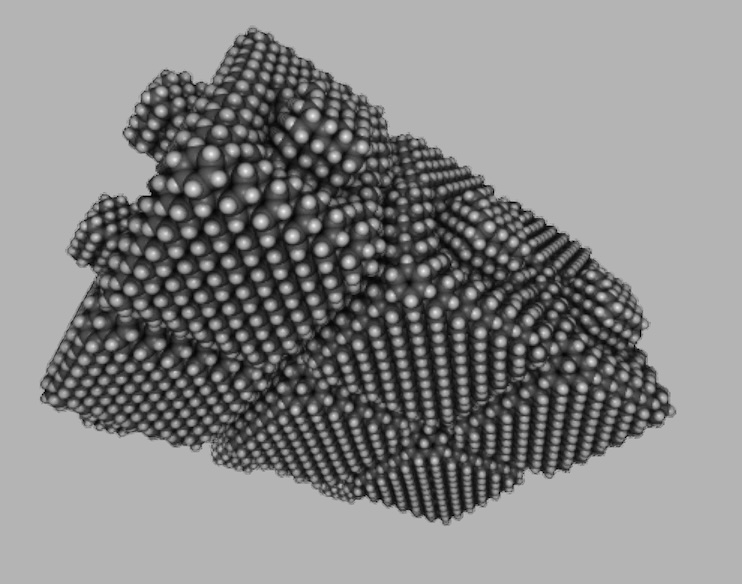

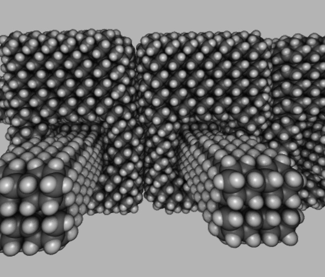

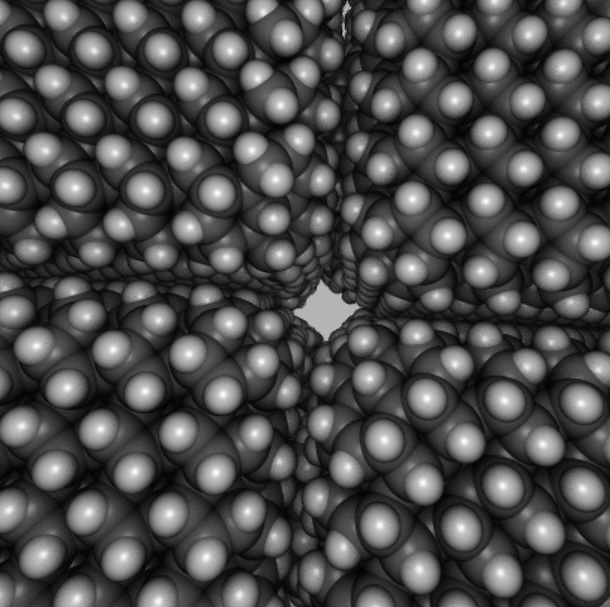

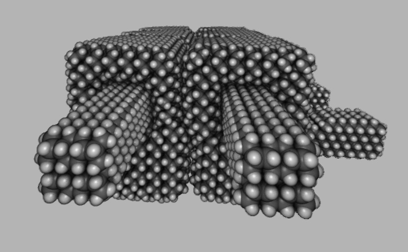

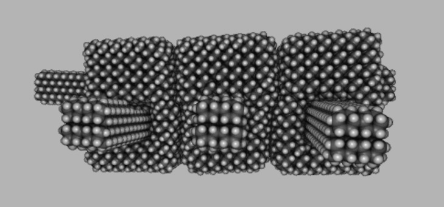

</div>

## Flywheel

Here is a prototype of a manufacturable flywheel. It mixed three different materials into one covalent solid - diamond, moissanite, silicon. They span a wide range of lattice constants, causing immense lattice strain. This is why the part has such a small radius of curvature. In addition, the silicon protrusion had a few intentional carbon dopants (first image). It was originally warped and pointing to the right. The dopants created a counter-strain pulling it to the left. With some careful tuning, the net strain was approximately zero.

The flywheel was originally tested without protrusions, using rigid body dynamics. It was discovered that the flywheel remained intact at 10 GHz, but not 20 GHz or higher. The protrusions were added to hopefully increase the vdW binding energy. This change would keep the system intact at higher speeds. When the part was minimized in isolation, the protrusions were slightly skewed (second image). This shape was different than the energy minimum when interacting with the other parts. The simulation was switched to the slower molecular dynamics, to let the parts deform into the vdW minimum.

> The revised simulation could have used rigid body dynamics, but the setup would be more complex.

The thermostat went as follows. Give each atom a velocity that matches 10 GHz overall rotation, but ensure nearby atoms have about the same velocity. The relative velocity between nearby atoms is the _thermal component_ of the velocity. Therefore, the initial temperature is ~0 K. Let the system evolve over time, periodically resetting the thermal component to zero. The simulation followed this timeline:

```
initialize with 0 GHz bulk angular velocity
simulate descent into vdW minimum (2.4 ps)
erase thermal velocities
simulate descent into vdW minimum (0.4 ps)
erase thermal velocities
simulate descent into vdW minimum (0.4 ps)
erase thermal velocities
initialize with 10 GHz bulk angular velocity
simulate rotation (36.4 ps)
```

The third image was taken at the end of the simulation. It had rotated 36.4% of an entire revolution. Since the flywheel has threefold symmetry, a 1/3 rotation looks similar to the starting position.

The part was stable at 10 GHz, but still fell apart at 20 GHz. This shows that vdW attraction cannot hold the flywheel together at high speeds. One needs geometric constraints / overlap repulsion to force the parts together. The operation speed equated to ~250 m/s at the curved segment and ~500 m/s at the tip of the protrusion. These speeds are not satisfactory. The ideal flywheel would have most of its mass moving at ~1 km/s, but the same atom count as this prototype.

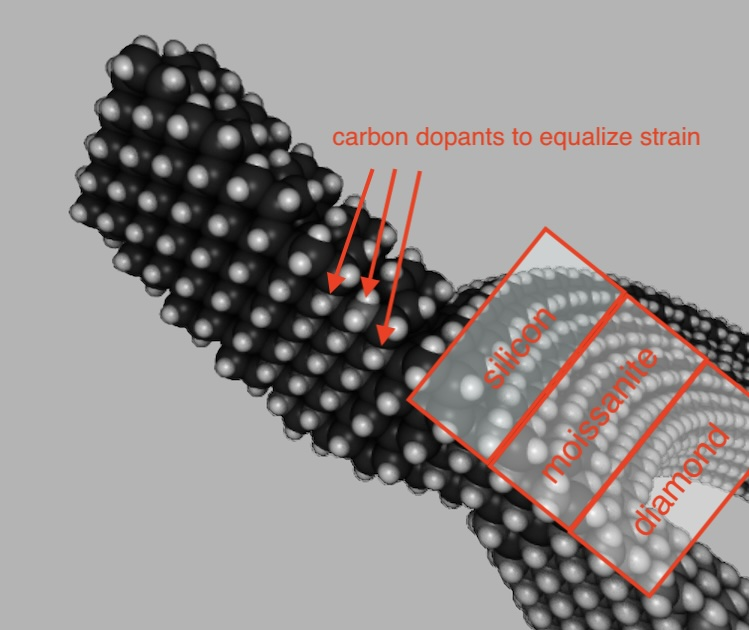


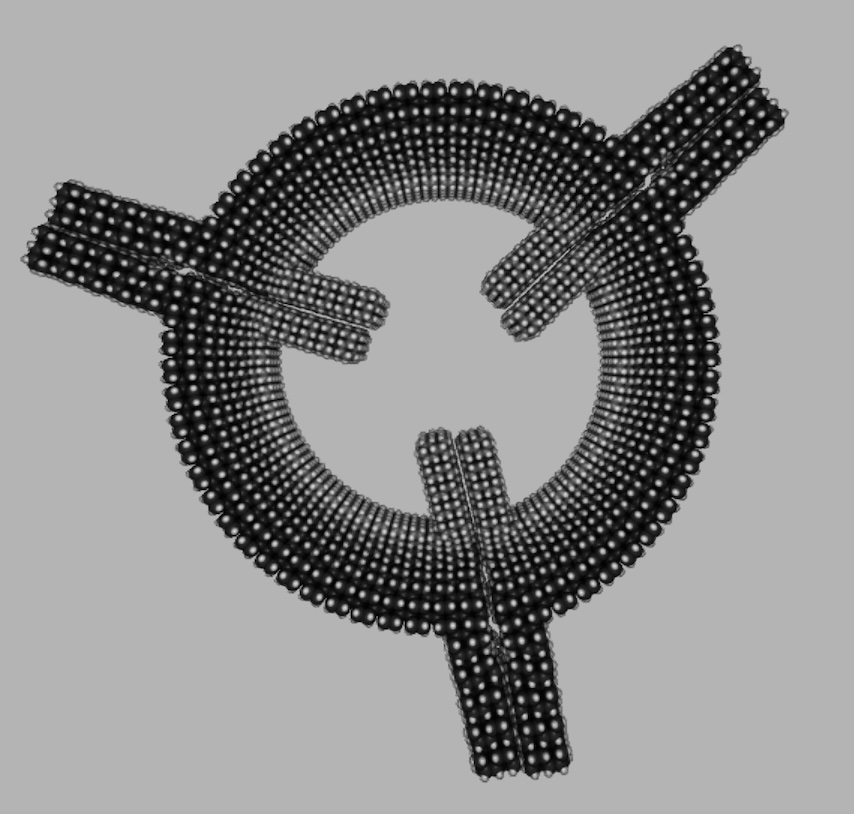

## Nitrogen Termination

As part of an effort to reduce atom count, I considered replacing some bridgehead carbons with phosphorus. This would reduce the number of hydrogen atoms, which are a large portion of the total atom count. The surface area of these parts is quite large. Hydrogens cover the surface area. After some preliminary sketching based on MM4 bond lengths and vdW radii, I realized phosphorus wouldn't improve compactness much. However, nitrogen would be useful. Nitrogen wasn't currently supported by MM4, but the parameters could be added if necessary.

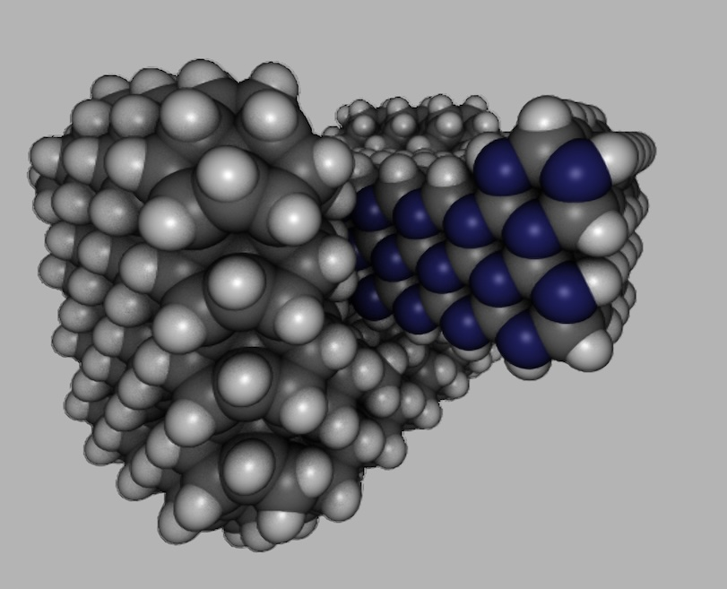

I predicted that N-terminating the logic rod could shrink each housing unit. The size reduction would be 1 lattice cell in two spatial directions. After putting the idea into atomic detail, I realized 0.5 lattice cells reduction was more realistic. I tested both the original C-H termination and the enhanced N-termination in GFN-FF, to check that they were roughly stable. The test system had 1400 atoms and took an entire minute to minimize. I then reduced the size to 800 atoms (~half). The system now took 1/4 as long to minimize because of GFN-FF's $O(n^2)$ scaling.

The final test used GFN2-xTB to maximize accuracy and confidence that this was stable. GFN2-xTB has $O(n^3)$ scaling, but the electronic structure is self-consistent. In previous experiments, the structures were qualitatively much better than GFN-FF. In addition, GFN-FF would crash or go haywire for a number of unknown reasons. I encountered such issues with GFN-FF during this experiment, but luckily was able to work around them. To simulate a massive structure without the cost of cubic scaling, I would use ONIOM. Simulate the rod and inner housing surface with GFN2-xTB, everything else with GFN-FF.

|         | GFN2-xTB | GFN-FF   |
| :-----: | :------: | :------: |
|  Atoms  | 196      | 832      |
| Bound State   | 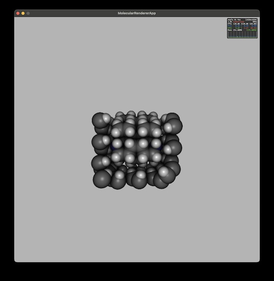 | 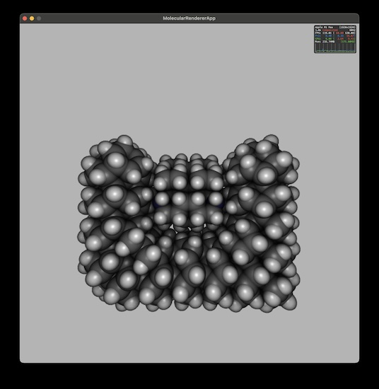 |
| Unbound State | 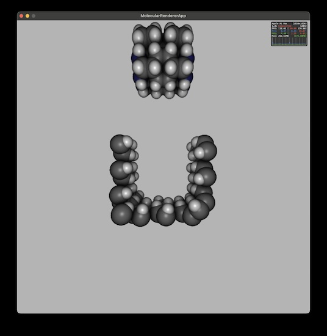 | 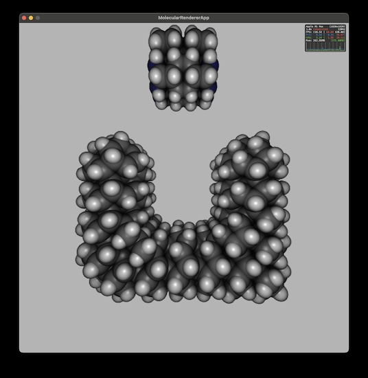 |

The N-terminated rod was kinetically stable inside the housing. I trust this result, as it was both predicted to be stable beforehand and corroborated by an accurate quantum mechanical method (GFN2-xTB). I also measured the energy difference between the rod being inside vs detached from the housing. If the latter is favored, the housing will reject the rod. The device will not function correctly because the rod is ejected from the housing.

```
Singlepoint calculation of whole system with low-level method

:::::::::::::::::::::::::::::::::::::::::::::::::::::
::                     SUMMARY                     ::
:::::::::::::::::::::::::::::::::::::::::::::::::::::
:: total energy            -162.041974221135 Eh    ::
:: gradient norm              0.993214593789 Eh/a0 ::

Singlepoint calculation of inner region with low-level method

:::::::::::::::::::::::::::::::::::::::::::::::::::::
::                     SUMMARY                     ::
:::::::::::::::::::::::::::::::::::::::::::::::::::::
:: total energy             -37.608739606057 Eh    ::
:: gradient norm              0.929836258917 Eh/a0 ::

Singlepoint calculation of inner region with high-level method

:::::::::::::::::::::::::::::::::::::::::::::::::::::
::                     SUMMARY                     ::
:::::::::::::::::::::::::::::::::::::::::::::::::::::
:: total energy            -339.999156565982 Eh    ::
:: gradient norm              1.002894360532 Eh/a0 ::
:: HOMO-LUMO gap              5.359252848273 eV    ::

 -------------------------------------------------
| TOTAL ENERGY             -464.432391181059 Eh   |
| GRADIENT NORM               0.008500429453 Eh/α |
 -------------------------------------------------
```

Bound state: -162.04 + 37.61 - 340.00 = -464.43 Ha

```
Singlepoint calculation of whole system with low-level method

:::::::::::::::::::::::::::::::::::::::::::::::::::::
::                     SUMMARY                     ::
:::::::::::::::::::::::::::::::::::::::::::::::::::::
:: total energy            -161.915062344301 Eh    ::
:: gradient norm              0.998496036159 Eh/a0 ::

Singlepoint calculation of inner region with low-level method

:::::::::::::::::::::::::::::::::::::::::::::::::::::
::                     SUMMARY                     ::
:::::::::::::::::::::::::::::::::::::::::::::::::::::
:: total energy             -37.543272576790 Eh    ::
:: gradient norm              0.930199287435 Eh/a0 ::

Singlepoint calculation of inner region with high-level method

:::::::::::::::::::::::::::::::::::::::::::::::::::::
::                     SUMMARY                     ::
:::::::::::::::::::::::::::::::::::::::::::::::::::::
:: total energy            -339.990065593082 Eh    ::
:: gradient norm              0.997945831572 Eh/a0 ::
:: HOMO-LUMO gap              6.417806487753 eV    ::

 -------------------------------------------------
| TOTAL ENERGY             -464.361855360594 Eh   |
| GRADIENT NORM               0.007629734036 Eh/α |
 -------------------------------------------------
```

Unbound state: -161.92 + 37.54 - 339.99 = -464.36 Ha

The unbound state is higher in energy by 0.07 Hartree. However, the energies for the GFN2-xTB system are about the same in each case. The energy difference might be an artifact of GFN-FF's inaccuracy. To test this hypothesis, observe the energy from GFN2-xTB alone (~340 Ha). It increases by 0.009 Ha upon entering the unbound state. The energy difference is still tens of zeptojoules. This seems significant enough for the problem in context.

| Measurement | Atomic Units | SI Units |
| ----------- | ------------ | -------- |
| ONIOM       | +0.071 Ha    |  +308 zJ |
| GFN2-xTB    | +0.009 Ha    |   +37 zJ |

In conclusion, N termination has a high chance of succeeding in a real-world engineering effort. Whether I want to add parameters to simulate nitrogen, is another matter. It only decreases atom count by a marginal amount (single digit percent). There are more economical ways to get even greater size reductions. However, it could reduce sliding friction.