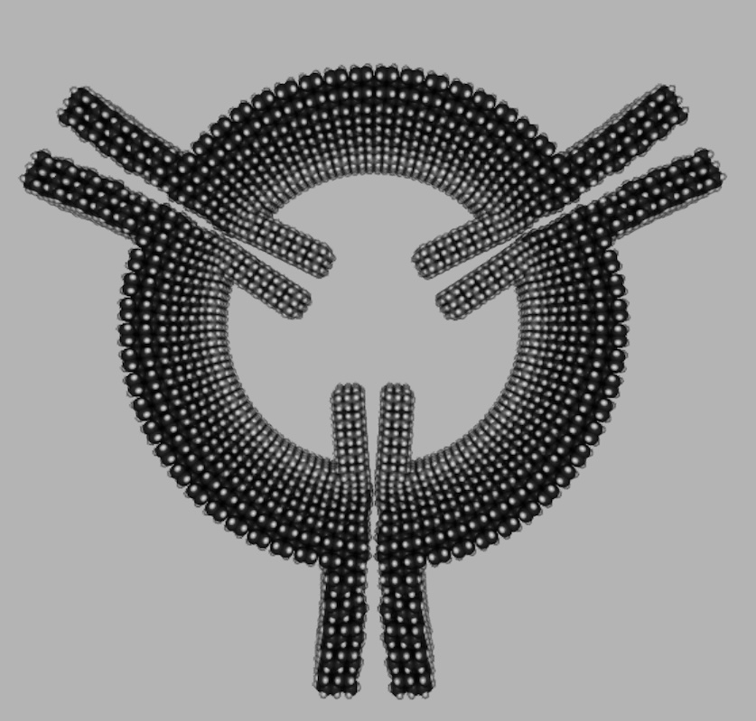

# Rod Logic

## XOR Gate

The housing is made of cubic diamond with orthogonal (100) surfaces. The rods are made of lonsdaleite. The lattice constant of the rods misaligns with the housing, providing more flexibility to fine-tune the vdW potential. However, knobs must be placed irregularly. Their separations aren't evenly divisible by the cubic diamond lattice constant.

The structure was energy-minimized to allow (100) surfaces to render with the reconstructed geometry. The structure remained stable after 48 ps of MD simulation, with temperature from leftover vdW energy that the minimizer didn't eliminate (last image). In a previous simulation without the logic rods, the structure had fallen apart.

<div align="center">


</div>

## Flywheel

Here is a prototype of a manufacturable flywheel. It mixed three different materials into one covalent solid - diamond, moissanite, silicon. They span a wide range of lattice constants, causing immense lattice strain. This is why the part has such a small radius of curvature. In addition, the silicon protrusion had a few intentional carbon dopants (first image). It was originally warped and pointing to the right. The dopants created a counter-strain pulling it to the left. With some careful tuning, the net strain was approximately zero.

The flywheel was originally tested without protrusions, using rigid body dynamics. It was discovered that the flywheel remained intact at 10 GHz, but not 20 GHz or higher. The protrusions were added to hopefully increase the vdW binding energy. This change would keep the system intact at higher speeds. When the part was minimized in isolation, the protrusions were slightly skewed (second image). This shape was different than the energy minimum when interacting with the other parts. The simulation was switched to the slower molecular dynamics, to let the parts deform into the vdW minimum.

> The revised simulation could have used rigid body dynamics, but the setup would be more complex.

The thermostat went as follows. Give each atom a velocity that matches 10 GHz overall rotation, but ensure nearby atoms have about the same velocity. The relative velocity between nearby atoms is the _thermal component_ of the velocity. Therefore, the initial temperature is ~0 K. Let the system evolve over time, periodically resetting the thermal component to zero. The simulation followed this timeline:

```
initialize with 0 GHz bulk angular velocity
simulate descent into vdW minimum (2.4 ps)
erase thermal velocities
simulate descent into vdW minimum (0.4 ps)
erase thermal velocities
simulate descent into vdW minimum (0.4 ps)
erase thermal velocities
initialize with 10 GHz bulk angular velocity
simulate rotation (36.4 ps)
```

The third image was taken at the end of the simulation. It had rotated 36.4% of an entire revolution. Since the flywheel has threefold symmetry, a 1/3 rotation looks similar to the starting position.

The part was stable at 10 GHz, but still fell apart at 20 GHz. This shows that vdW attraction cannot hold the flywheel together at high speeds. One needs geometric constraints / overlap repulsion to force the parts together. The operation speed equated to ~250 m/s at the curved segment and ~500 m/s at the tip of the protrusion. These speeds are not satisfactory. The ideal flywheel would have most of its mass moving at ~1 km/s, but the same atom count as this prototype.




